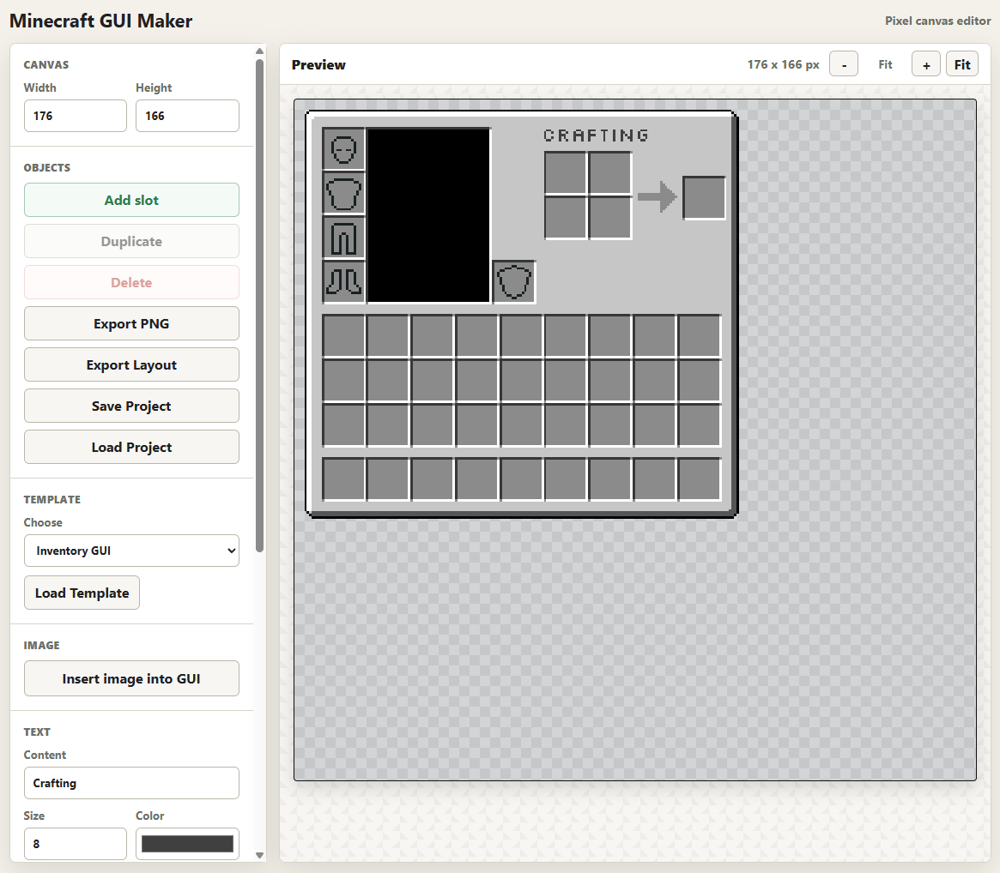

# Minecraft GUI Maker

A small browser-based editor for building Minecraft-style GUI textures and matching layout JSON. It is designed for pixel-precise GUI work: slots, custom images, text, templates, zooming, selection, export, and editable project saves.



## Disclaimer

This is an unofficial fan-made tool and is not affiliated with Mojang, Microsoft, or Minecraft.

## Status

This is an early browser-based tool. It should work for simple Minecraft GUI texture/layout creation, but the exported layout JSON is meant as helper data, not automatic mod code.

## Features

- Pixel-art canvas with a faded checker background.
- Minecraft-style GUI frame rendered from `atlas.png`.
- Add, move, duplicate, delete, and box-select objects.
- Add slots, including invisible slots for layout-only hit areas.
- Add slot-owned icon overlays for armor, shield, or other slot hints.
- Insert custom images and move them around the GUI.
- Add pixel-font text using the bundled Silkscreen font.
- Import a custom `.ttf`, `.otf`, `.woff`, or `.woff2` font for text rendering.
- Layer images and text with bring-forward/send-backward controls.
- Slots are always drawn and selected above images/text, including invisible slots.
- Zoom and scroll the editor without changing export size.
- Export a PNG at the original GUI size.
- Save/load editable `.mcgui.json` project files.
- Export lightweight `.layout.json` files without embedded image data.
- Load GUI templates from `templates/manifest.json`.

## Quick Start

This project has no build step and no package install. It is plain HTML, CSS, and JavaScript.

For the best experience, run it from a local server so templates can be loaded from the `templates` folder:

```powershell
python -m http.server 5500
```

Then open:

```text
http://127.0.0.1:5500/
```

Opening `index.html` directly can work for basic editing, but browser file restrictions may prevent external template files from loading.

## Controls

- `Add slot`: creates a Minecraft inventory slot.
- `Duplicate`: duplicates the current selection.
- `Delete`: deletes the current selection.
- `Export PNG`: downloads the rendered GUI texture at original size.
- `Export Layout`: downloads lightweight layout JSON.
- `Save Project`: downloads an editable project JSON with embedded image data.
- `Load Project`: loads a saved editable project.
- `Load Template`: replaces the current editor contents with the selected template.
- `Insert image into GUI`: adds a custom image object.
- `Add Text`: adds a text object using the active pixel font.
- `Import custom font`: replaces the active text font for the current editor session.
- `Send Backward` / `Bring Forward`: changes image/text layer order.
- `Slot visible in PNG`: toggles selected slot visibility for PNG export.
- `Import slot icon`: adds an icon overlay to the selected slot.
- `Clear Slot Icon`: removes the selected slot's icon overlay.

Keyboard shortcuts:

- `Ctrl+D`: duplicate selection.
- `Ctrl+X`: delete selection.
- `Ctrl+mouse wheel`: zoom in/out.

## Coordinate Notes

Canvas width and height are the final exported PNG dimensions, including the 4 px GUI frame on each side.

The editable `X` and `Y` fields are relative to the inside of the GUI frame. `Absolute X` and `Absolute Y` are read-only display fields that include the frame offset.

Slot layout export positions use the slot's usable top-left pixel rather than the selection outline corner, so exported slot coordinates are corrected by the slot's 1 px visual inset.

## Save vs Layout Export

`Save Project` creates an editable `.mcgui.json` file. Use this when you want to come back later and continue working. Custom images and slot icons are embedded as data URLs, so the file is self-contained. Custom font files are not embedded in project saves. Text objects save their content, position, size, color, and font reference, but not the actual `.ttf`, `.otf`, `.woff`, or `.woff2` file.

When a project is loaded, text falls back to the bundled Silkscreen font unless the matching custom font has been imported again during the current editor session. This keeps project files from accidentally redistributing font files.

`Export Layout` creates a lightweight `.layout.json` file. Use this when you only need the GUI layout data and do not want embedded image data. Images and text are listed with position, size, layer, and `bakedIntoTexture` metadata. Slot icons are listed by name only.

Invisible slots:

- Do not appear in PNG exports.
- Stay visible as faint editor guides.
- Remain selectable and movable.
- Are included in project saves and layout exports.

## Templates

Templates live in the `templates` folder. The available options are listed in:

```text
templates/manifest.json
```

To add a template:

1. Create a new template JSON file in `templates`.
2. Add an entry to `templates/manifest.json`.
3. Run the project from a local server and refresh the page.

Current templates:

- Inventory GUI
- Furnace GUI
- Crafting Table GUI

## Project Files

```text
index.html                    App markup and styles
code.js                       Canvas rendering, editor behavior, export, save/load
inputs.js                     Input validation and read-only display field handling
assets/atlas.png              GUI frame and slot source texture
fonts/Silkscreen-Regular.ttf  Default font used for text objects
fonts/OFL.txt                 License for the bundled Silkscreen font
docs/screenshot.png           README screenshot
templates/                    Template manifest and template JSON files
LICENSE                       MIT license for the project code
README.md                     Project documentation
```

## Development Notes

The editor display uses a scale multiplier so tiny pixels are easier to see, but PNG export does not use that multiplier. Exported PNGs use the original GUI size.

Slots are treated as a fixed top layer. Image and text objects can be layered relative to each other, but slots always render and hit-test above them.

Slot icons are part of the slot itself rather than regular image layers. They render above the slot frame, which keeps armor/shield hint graphics visible without letting normal images cover or interfere with slot selection.

## License

This project is licensed under the MIT License. See `LICENSE` for details.

The bundled Silkscreen font is licensed separately under the SIL Open Font License 1.1. See `fonts/OFL.txt` for details.
